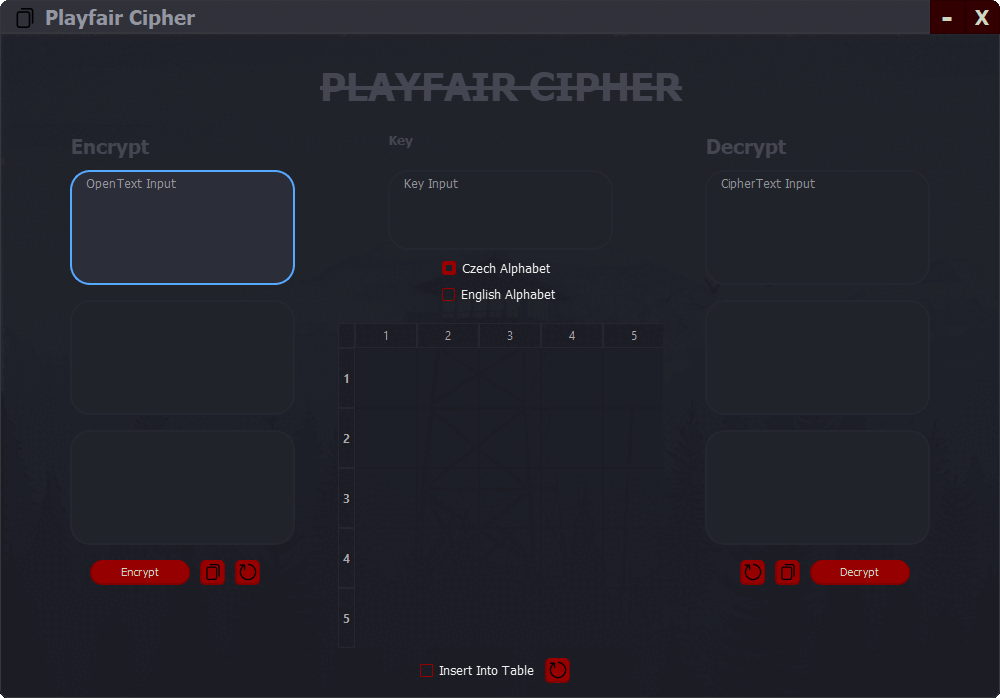

# **Python cryptography projects**

## Used apps

* **IDE**: Visual Studio Code - Python
* **GUI Design**: Qt Designer (PyQt 5) with CSS styling

## Description

Welcome to my portfolio of Python cryptography projects! From classic ciphers like ADFG(V)X and Playfair to more modern algorithms like RSA, my projects cover a range of encryption and decryption techniques. Additionally, I delve into areas such as Steganography and the implementation of cryptographic protocols for signing and verifying like DSA.

# ADFG(V)X Cipher

### Description

The ADFGVX cipher is a transposition and substitution cipher used during World War I. It was developed by the German army and is named after the six possible letters used in the cipher: A, D, F, G, V, and X. The cipher involves a two-step process of transposition and substitution, making it more secure than traditional ciphers.

I have implemented both versions, ADFGX and ADFGVX, supporting Czech and English languages. ADFGX employs a 5x5 matrix with one letter removed, while ADFGVX uses a 6x6 matrix with all letters and numbers included. Language-specific adjustments are made for letter substitutions (**Czech** removes `W` and replaces it with `V`; **English** removes `J` and replaces it with `I`), and spaces are replaced with `XQX`.

### Implemented features

Copy buttons for generated cipher text, matrix, and decrypted text  
CheckBoxes for selecting ADFGX or manually inputting the matrix (otherwise app uses randomly generated 6x6 matrix)  
Radio buttons for language-specific configurations  
Label animations for user interaction feedback  
Customized transparency and title bar

### Known Issues

> One identified issue is the freezing of animations when multiple copy buttons are clicked simultaneously.
>>This has been resolved in subsequent projects by implementing separate animation groups for each button.

***

# Playfair Cipher

### Description

The Playfair cipher, invented by Charles Wheatstone in 1854, is a manual symmetric encryption technique. It employs a 5x5 matrix constructed from a keyword to encrypt and decrypt messages, providing a higher level of security than simple substitution ciphers.

Similar to the ADFGX cipher, Playfair also requires the replacement of one letter, with language-specific adjustments for Czech and English (same as in ADFGX).

Input validations ensure that the key length is adequate. All user inputs and options are validated to prevent the application from proceeding without necessary inputs, prompting the display of appropriate error messages.

### Implemented features

Copy buttons for generated cipher text and decrypted text  
CheckBox for manual matrix insertion  
Radio buttons for language-specific substitutions  
Label animations for user interaction feedback  
Customized transparency and title bar

***

# RSA

### Description

RSA is an asymmetric encryption algorithm developed in 1977 by Ron Rivest, Adi Shamir, and Leonard Adleman. Widely used for secure communication and digital signatures, RSA relies on the mathematical properties of large prime numbers and modular arithmetic. It utilizes a public key for encryption and a private key for decryption. Security is based on the difficulty of factoring large composite numbers.

In this project, users input plaintext, and upon clicking `Encrypt`, the app generates random keys (Private and N key are then used to decrypt the message). When the user wants to decrypt a message, he can copy the keys or click on the paste button (with the arrow) and check the checkbox. Then he can insert ciphertext and click on `Decrypt`.

### Implemented features

Copy buttons for generated cipher text and decrypted text  
Checkbox for decryption authorization  
Label animations for user interaction feedback  
Customized transparency and title bar

***

# Steganography

### Description

Steganography is the practice of concealing a message, file, or other data within another file, message, or piece of media. In the context of images, steganography involves hiding information within the pixels of an image without affecting its visual appearance. This can be achieved by modifying the least significant bits of the pixel values to encode the hidden data.

User can Browse an image everywhere on machine and can hide the Open text message into selected image. This project is using LSB (Least Significant Bit) manipulation. But unlike traditional methods, which use the last bit of every third pixel to indicate the end of the message, this project optimizes space utilization.

Using LSB **each pixel can hold 3 bits, and each character requires 8 bits** (App will skip any characters with ASCII values greater than 255), so a character ocupies `2.67` of pixels (8 bits). The other `0.33` of the third px (1 bit) is added to the next character from Open text. And to determine when to stop decrypting the message, in the encryption process, app will add 6 letters to the end of the Open text.  
This way we can get to hide way more characters then if the last `0.33` of every third pixel was used to determide whether to stop or continue decrypting (this method would **lose 1 bit per character** of the Open text).

### Implemented features

Image browsing supporting lossless formats (PNG, BMP, TIFF)  
Image saving, that will save the image to a desired location  
Label animations for user interaction feedback  
Metadata about the image (resolution, message capacity, size in human readable format, ...)  
Customized transparency and title bar

***

# DSA

### Description

DSA, or Digital Signature Algorithm, is a widely-used asymmetric encryption algorithm designed for providing digital signatures to ensure data integrity and authentication. Proposed by the NIST, DSA is a standard for digital signatures, leveraging mathematical principles such as modular exponentiation and discrete logarithms (this project uses previously mentioned RSA). The DSA algorithm involves the use of a public key for verifying signatures and a private key for generating signatures.

In this project, users can select a file to sign. They have the option to generate keys or use pre-existing ones (identified by .pub and .priv extensions). After generating keys, users have the option to save them and after signing the file, users can save both the signed file and the original to a zip archive. The signed file contains the hash of the original file, signed by private key and is then encoded using base64. For file verification, users can select the zip file containing the signed file, designate the destination of the public key, and click `Verify`. If the file remains unaltered, the signature is valid; otherwise, it's deemed invalid.

### Implemented features

File browsing for selecting files to sign or verify  
Saving of signed files and originals in a zip archive  
Tooltips for guiding users on button functionalities  
Greyed out buttons until necessary actions are performed, reducing the need for error dialogs  
Progress bars for large file loading indication  
Label animations for user interaction feedback  
Metadata display for various file types, offering previews and details such as bitrate and length for audio and video files, image metadata, previews of document files, and contents display for zip files  
Customized transparency and title bar

***

## Things I would change in projects

> Implement codebase modularization by splitting into modular files for improved organization, and enhance clarity and maintainability through detailed comments (DSA already includes complete comments).
